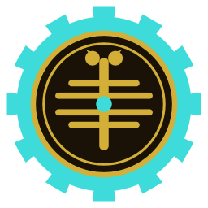

<div align="center">



# Praetorium

**A desktop command post for your Claude Code sessions.**

Watch live agent runs, explore the spawn graph of agents and subagents, and browse your vault — all from one frameless, themeable native window.

[](https://tauri.app)
[](https://www.solidjs.com)
[](https://www.typescriptlang.org)
[](#license)

</div>

---

## What it is

Praetorium is a native desktop app (Tauri + SolidJS) that turns the firehose of a running [Claude Code](https://claude.com/claude-code) session into something you can actually *see*. It launches the `claude` CLI, streams its events in real time, and renders the unfolding work as a force-directed graph of master agents, subagents, tool calls, and the files they touch.

It also doubles as a live explorer for your knowledge vault — the folder graph, the wikilinks between notes, and per-session transcripts — so the context the agents are working in is always one click away.

## Features

- **Console** — a terminal-styled live feed of the active session, collapsing consecutive agent lines into readable nested blocks.
- **Cockpit** — a force-directed graph of the session: master nodes, spawned subagents, and folder activity, with `radial` and `hierarchical` layouts. Repeated work is grouped into weighted master nodes.
- **Explorer** — the merged vault graph: folders, files, and the wikilinks that connect them, with Folders/Full toggles.
- **Live session watching** — sessions are polled and watched on disk; new turns, subagent spawns, and tool activity appear as they happen.
- **Themes & glass** — multiple built-in palettes (BENCH, DIM, FORGE, FOREST, DUSK, OCEAN, …) plus an optional translucent glass mode and reduce-motion support.
- **Frameless native chrome** — custom draggable titlebar with real minimize / maximize / close controls.

## Tech stack

| Layer      | Stack                                                        |
| ---------- | ------------------------------------------------------------ |
| Shell      | [Tauri 2](https://tauri.app) (Rust)                          |
| UI         | [SolidJS](https://www.solidjs.com) + TypeScript + Vite       |
| Graph/Viz  | `d3-force`, `d3-hierarchy`                                   |
| Content    | `marked` (markdown), custom wikilink + folder-graph parsing  |
| Tests      | [Vitest](https://vitest.dev)                                 |

The Rust backend (`src-tauri/`) exposes commands for running the Claude CLI (`run_claude`), reading the vault and its folder graph, and listing/watching sessions. The Solid frontend (`src/`) consumes these over Tauri's IPC channels.

## Getting started

### Prerequisites

- [Node.js](https://nodejs.org) 20+
- [Rust](https://www.rust-lang.org/tools/install) (stable) and the [Tauri prerequisites](https://tauri.app/start/prerequisites/) for your OS
- The [Claude Code CLI](https://claude.com/claude-code) (`claude`) on your `PATH`

### Develop

```bash
npm install
npm run tauri dev
```

### Build

```bash
npm run tauri build
```

### Test

```bash
npm test
```

## Project layout

```
src/                 SolidJS frontend
  components/         Console, Cockpit, Explorer, Settings, WindowControls, …
  lib/                graph + layout engine, session/run stores, vault parsing
  themes/             theme tokens and palette definitions
src-tauri/            Rust backend (commands, session watcher, vault reader)
  capabilities/       window + shell permission grants
docs/                 design notes and preview
```

## License

MIT
